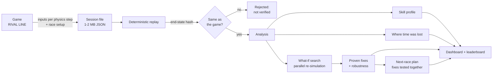
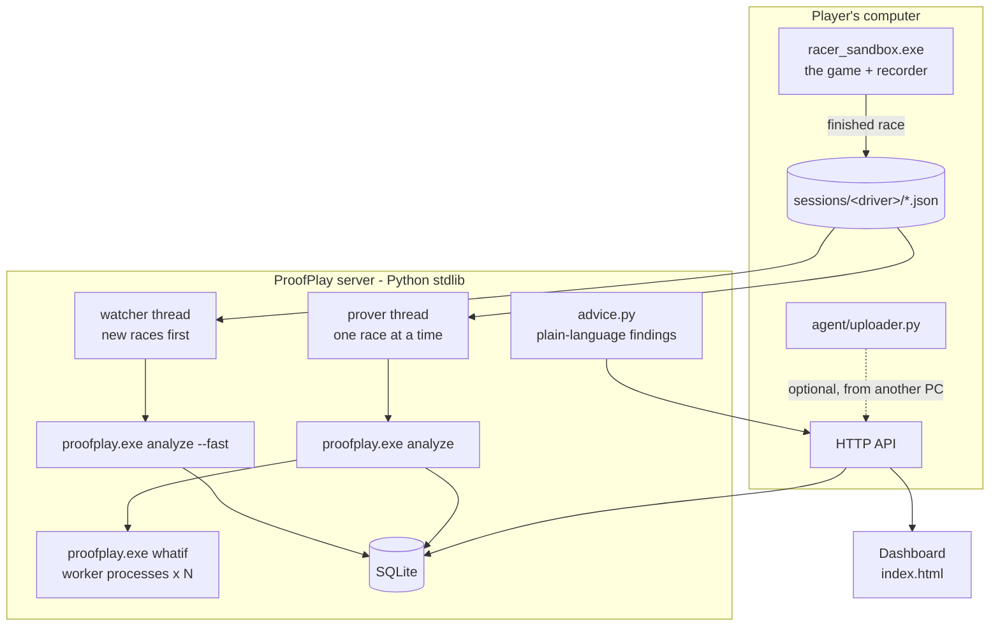

<p align="center">
  <picture>
    <source media="(prefers-color-scheme: dark)" srcset="proofplay/dashboard/assets/proofplay-logo-dark.svg">
    
  </picture>
</p>

<h3 align="center">The race coach that only gives advice it has proven.</h3>

<p align="center">
  Every fix is re-simulated in the game's own physics before you see it.<br>
  Built on <b>RIVAL LINE</b>, our original C++ combat racer.
</p>

<p align="center">
  <a href="#how-it-works">How it works</a> ·
  <a href="#measured-results">Results</a> ·
  <a href="#quick-start">Quick start</a> ·
  <a href="#building-from-source">Build</a> ·
  <a href="#team">Team</a>
</p>

---

## Contents

- [The problem](#the-problem)
- [What ProofPlay does](#what-proofplay-does)
- [A two-minute demo](#a-two-minute-demo)
- [How it works](#how-it-works)
- [The algorithm in detail](#the-algorithm-in-detail)
- [Measured results](#measured-results)
- [What it does not do (yet)](#what-it-does-not-do-yet)
- [The dashboard](#the-dashboard)
- [Architecture](#architecture)
- [Quick start](#quick-start)
- [Running on another computer](#running-on-another-computer)
- [Building from source](#building-from-source)
- [Command reference](#command-reference)
- [RIVAL LINE, the game underneath](#rival-line-the-game-underneath)
- [Repository layout](#repository-layout)
- [Tech stack](#tech-stack)
- [Roadmap](#roadmap)
- [FAQ](#faq)
- [Team](#team)
- [Acknowledgements](#acknowledgements)

---

## The problem

Players who want to get faster get two kinds of help today:

- **Statistics** (lap times, top speed, hit rate). They say *that* you were slow, not *what to change*.
- **Coaches**, human or AI, that look at those statistics and guess. A guess sounds convincing,
  but nobody checks whether following it actually makes you faster.

We checked. We let three coaches advise on 14 races with known, planted mistakes and then
**tested every single tip in the game itself**. A rule-based coach made the player slower or
crashed them in 59 % of its tips. An LLM coach (gpt-5-mini) did better, yet one tip in five
still made things worse. Advice that cannot be checked cannot be trusted.

## What ProofPlay does

ProofPlay records a race inside the game, replays it exactly, and answers three questions
for the player right after the finish line:

1. **Where did the time go?** Every part of the lap is compared with your own best lap, and
   the cause is named: you were hit, you stopped, you ran wide, you were wrecked, the start.
2. **What should I change?** For each corner ProofPlay changes your braking or throttle by a
   human-sized amount, re-runs your exact race in the game's physics, and keeps only the
   changes that made you faster without crashing. That is a **proven fix**.
3. **What is my plan for the next race?** Fixes affect each other, so ProofPlay tests them
   together and shows the combination that really works, as a short checklist.

The same replay powers a **tamper-proof leaderboard**: a result counts only if it reproduces
bit for bit from its own recorded inputs.

> **"Every AI coach can give advice. ProofPlay only gives advice it has proven."**

## A two-minute demo

1. Double-click `proofplay/ProofPlay.pyw`. The dashboard opens.
2. Press **Start session** and type your name. Open the game and drive a race.
3. Cross the finish line. A few seconds later the race is on the dashboard: position, lap
   times, and the biggest time loss as the headline (for example *"Lap 2, 460-680 m:
   3.4 s lost. You were hit by Needle once."*).
4. About a minute later the **proven fixes** arrive. Click one: the map zooms to the corner and
   animates two cars side by side, your real line and the proven faster line.
5. The **plan** card shows what to practise next race and how much it saves, measured in a
   re-run where all the chosen fixes were applied together.
6. Edit the race file by hand and upload it. It is marked *not verified* and never reaches
   the leaderboard.

## How it works



1. **Record.** The game saves every physics step of the player's inputs (steering, throttle,
   brake, weapon, reset) plus the race setup: track, grid, cars, garage parts, difficulty,
   weather, event rules. Nothing else is captured: no video, no screenshots.
2. **Replay.** RIVAL LINE is deterministic, so feeding the same inputs into the same physics
   reproduces the race exactly. An end-state hash (FNV-1a over every car's position, velocity and health) proves it.
3. **Analyse.** From the replay ProofPlay measures skills, finds the corners from the track
   geometry, and compares the race with the player's own best lap.
4. **Prove.** For each corner, candidate changes are re-simulated in parallel worker
   processes. Only changes that gain time without a crash or reset survive.
5. **Plan.** The best combinations of proven fixes are re-simulated together on one lap.
6. **Show.** The dashboard explains each finding in plain language, with the numbers behind
   it and a map of where it happened.

Analysis runs in stages, so the player is never waiting on the slow part: results-screen
numbers in about a second, replay analysis in about 5-15 s, proven fixes and the plan in
roughly 45-130 s (up to about 5 minutes on a long 12-car race).

## The algorithm in detail

### 1. Recording and determinism

- The recorder (`proofplay/src/Recorder.cpp`) sits inside the game's race loop and appends one
  input record per fixed physics step (120 Hz).
- The race is saved **the moment the player crosses the finish line**, written to a temporary
  name first and then renamed, so the server never reads half a file.
- The headless replayer (`proofplay/src/Session.cpp`) rebuilds the race the same way the game
  does: same roster and grid order, same garage parts, same event rules and mounted weapon,
  same weather. It needs no GPU (39 MB of RAM per process).
- Replay runs at roughly 10-35× real time on a desktop CPU.

### 2. Corners and the ideal speed profile

The track centreline is sampled and a physics-based speed profile is computed (lateral grip,
braking and drive limits of the player's car). Corners are the local minima of that profile:
on the 2.2 km dock circuit S01 they come out as 3 corners, on the longer container circuit L01
as 14. Any new track in `content/tracks/` works without hand-made data.

### 3. Skill profile

Six ratings from 0 to 99, each linearly calibrated against easy, normal and hard bot runs
(40 at the "weak" end of the range, 90 at the "strong" end):

| Skill | Measured as |
|---|---|
| Pace | speed relative to the ideal profile, over the whole race |
| Line | mean distance from the racing line through corners |
| Combat | hits per weapon used |
| Defence | attacks blocked out of attacks received |
| Consistency | spread of time lost in the same corner across laps |
| Recovery | resets and respawns |

The overall rating maps to tiers: **Bronze** (below 55), **Silver** (55+), **Gold** (70+),
**Elite** (85+).

### 4. Where the time went

A human is often faster than any AI profile in some corners and loses whole seconds elsewhere.
So ProofPlay compares each lap with **the player's own best lap**, 20 m at a time, merges
neighbouring losses into stretches, and tags what happened in each stretch from the replay's
event log: hits (and by which weapon), near-stops, running wide, wrecks, the standing start.

### 5. What-if search

For every corner the passes are sorted by time lost, and the worst pass is re-simulated with
11 variants: the player's action point moved by 0, ±5, ±10, ±15, ±20 or ±30 m.

- **Up to the change the race is the exact replay.** After it, the player's own inputs are
  played back by *track position* (not by time), because the car is no longer where it was at
  a given tick.
- The kind of change follows how the player actually took the corner: **brake** earlier or
  later if they braked, **lift** earlier or later if they only lifted off, a **short brake**
  if they went through flat out. (A measured keyboard player braked in only 1 of 9 corners.)
- Gain is measured 60 m past the corner exit, against the variant with no change.
- A variant that crashes, needs a reset, or never reaches the measuring point is discarded.
- Jobs are spread over worker processes, each with its own physics job pool (threads inside
  one process stalled each other and were slower than serial).

### 6. Robust fixes

Nobody hits a braking point to the metre. A fix is marked **robust** when the neighbouring
distances on both sides are also safe (no crash, no real loss), and robust fixes win over a
slightly bigger but knife-edge gain. The dashboard also shows the **window** that works, for
example *"anything from 10 to 30 m later also saved time"*, or warns *"exact point only"*.
This costs no extra simulation: it is read from the 11 variants already run.

### 7. The next-race plan

Single gains do not add up. Measured on our test races:

| Race | Sum of single gains | All fixes together |
|---|---|---|
| Bot_Qusurlu (planted mistake) | 1.40 s | **0.97 s** faster |
| Bot_Normal | 1.16 s | **0.69 s slower** |
| L01, 14 corners | 9.13 s | **crashed** |

So ProofPlay applies the fixes on **one lap**, the way the player will actually try them,
and re-simulates the top 2, 3, 4 and 5 fixes (by single gain) plus "all of them", each
against one shared baseline, all in parallel. The plan is the best combination that is valid;
if no combination works, the dashboard says *"one at a time"* and why.

Playing inputs back open-loop over a long distance can drift (on one race the baseline got
stuck where the original driver had used a reset), which is why the plan stays within a lap.

### 8. Tamper-proof leaderboard

A submitted race is replayed by the server. If the replayed end state does not match the
recorded one, the race is *not verified* and never counts. The tamper test forges ten kinds
of changes (a faster time, 1st place, a fake hash, one flipped steering input, braking
replaced by throttle, easier opponents, an easier field, cut-off steps, a lap fewer, an added
performance part) and all ten are rejected.

## Measured results

| What | Result | Where |
|---|---|---|
| Tips that save time: ProofPlay / LLM coach / rule coach | **100 %** (31/31) / 76.5 % / 37.5 % | `proofplay/results/benchmark.md` |
| Tips that make it worse or crash | **0 %** / 21 % / 59 % | same |
| Mean gain per tip | **1.05 s** / 0.63 s / 0.31 s | same |
| Cost of the LLM coach run (14 races, gpt-5-mini) | about $0.04 | `proofplay/bench/` |
| Forged sessions rejected | **10 / 10** | `proofplay/tests/tamper_test.py`, `proofplay/results/tamper.json` |
| Game results screen vs replay | **12 / 12** values identical | `docs/DECISIONS_M2.md` (D-095) |
| Replay of human, bot, autotest and career races | bit-identical (MATCH) | D-094, D-099 |
| Input changes per step, human vs bot | 2.4 % vs 91-95 % (one human so far) | D-095 |
| First result after the finish line | about 2-15 s | D-098, D-099 |
| Full analysis with proofs and plan | 45-130 s typical, about 5 min for L01 (12 cars) | D-097 |
| Memory per analysis process | about 39 MB (no GPU device) | D-094 |

Every decision in this project is written down with its measurement in
[`docs/DECISIONS_M2.md`](docs/DECISIONS_M2.md).

## What it does not do (yet)

We would rather show the limits than hide them:

- **Racing only.** Other genres need an adapter that can record and deterministically replay
  that game. A screen-recording adapter for games without a replay is future work, not a claim.
- **Unfinished races are not saved.** A race left before the finish line has no end state to
  verify, so it is dropped.
- **Braking and throttle only.** The what-if search does not yet try different steering lines
  or weapon timing.
- **Small human sample.** The human-vs-bot signal and the skill calibration are based on few
  human races; a pilot study is planned.
- **Windows only** for the analysis binary today. Wicked Engine supports Linux, but our build
  has not been tried there.
- **Fonts and icons come from a CDN.** Offline, the dashboard falls back to system fonts and
  the icons do not show.

## The dashboard

- **Debrief** with the single most important finding as the headline, key numbers, the car
  you drove (rendered from the game's own model) and your rating with its tier.
- **Analysis progress**: results screen, replay analysis, proven fixes, verified.
- **Your plan for the next race**: a checklist of the proven fixes worth practising, with the
  measured combined gain and a copy button.
- **Interactive track map** built from the real track render: zoom, pan, numbered pins for
  every finding, the lost stretches in red, and an animated side-by-side of your line and the
  proven line. Keyboard: ↑/↓ to step through findings, Esc for the whole track.
- **Findings** in plain language, each with its evidence (number of test runs, speeds in and
  out of the corner, the window that works).
- **Driver profile**: radar chart of the six skills, lap times, combat and recovery numbers.
- **Since last race**: rating and time change on the same track.
- **Leaderboard** of replay-verified races only, with Gold, Silver, Bronze and Elite badges.
- **Live sessions**: Start session, drive, and every finished race lands under your name.
- **Upload** a race file (button or drag and drop) from another computer.
- Light and dark theme, works on a phone, respects reduced motion.

## Architecture



- **`proofplay.exe`** (C++20) links the game's own core and runtime libraries, so the replay
  uses exactly the same rules and physics code as the game.
- **The server** (`proofplay/dashboard/server.py`) needs only the Python standard library. It
  watches the sessions folder, runs the stages, stores reports in SQLite, rebuilds the plain
  language explanations on every request, and serves the dashboard.
- **Supported games** are listed in `proofplay/dashboard/games.json` (name, process name,
  adapter). The server notices which one is running; it never launches a game itself.

## Quick start

On the computer with the game (Python 3.10+):

1. Double-click **`proofplay/ProofPlay.pyw`**. The dashboard opens at http://localhost:8787.
2. Press **Start session**, type your driver name.
3. Open the game and race. Every race you finish shows up under your name.
4. **Stop session** when you are done; **Quit ProofPlay** at the bottom of the page stops the
   server.

Or start the server by hand: `python proofplay/dashboard/server.py`.

## Running on another computer

```bash
python proofplay/package.py --zip
```

builds `dist/ProofPlay` (about 17 MB): the analysis binary with its runtime libraries, the
track and car data a replay needs, the dashboard and server, the uploader and the launcher.

| Mode | How |
|---|---|
| One PC | `ProofPlay.pyw` or `start_server.bat`, open http://localhost:8787 |
| Local network | `start_server_lan.bat` on the server; others open `http://<server-ip>:8787` and upload races, or run `start_uploader.bat` on their PC to send every race automatically |
| Internet | the same package on a Windows VM behind an HTTPS reverse proxy |

Uploads are not trusted: the server replays every race itself. Upload names and sizes are
validated; starting a session or quitting only works from the server's own computer and needs
a custom header, so another website open in the browser cannot trigger it.
Full guide: [`docs/hackathon/PROOFPLAY_DEPLOY.md`](docs/hackathon/PROOFPLAY_DEPLOY.md).

## Building from source

Windows 10/11, Visual Studio 2022 (C++ workload), CMake 3.19+, Python 3.10+.

```bash
git clone --recursive https://github.com/20hajiyev/ProofPlay.git
cd ProofPlay
git -C engine/WickedEngine apply ../patches/0001-expose-vehicle-constraint.patch ../patches/0002-deterministic-body-creation.patch ../patches/0003-toon-crease-ink.patch ../patches/0004-small-rain-pool.patch
cmake -S . -B build/game -G "Visual Studio 17 2022"
cmake --build build/game --config Release --target racer_sandbox proofplay
```

- The game: `build/game/game/sandbox/Release/racer_sandbox.exe`
- The analyser: `build/game/proofplay/Release/proofplay.exe`
- Tests: `ctest --test-dir build/game -C Release` (core rules, handling, audio, fixtures)

Optional, for the LLM-coach benchmark: put `PROOFPLAY_AOAI_ENDPOINT`, `PROOFPLAY_AOAI_KEY` and
`PROOFPLAY_AOAI_DEPLOYMENT` in `proofplay/llm.env` (git-ignored, never committed).

## Command reference

```text
proofplay record   --out s.json [--track S01] [--laps 2] [--cars 4] [--bot Normal] [--flaw early_brake:<route_s>:<metres>]
proofplay replay   <session.json>                        verify: MATCH or mismatch
proofplay analyze  <session.json> --out report.json [--fast]
proofplay evaluate <session.json> <advice.json>          test any coach's advice by re-simulation
python proofplay/bench/benchmark.py                      rule vs LLM vs ProofPlay coach
python proofplay/tests/tamper_test.py                    forged-session test
```

| Setting | Effect |
|---|---|
| `server.py --host 0.0.0.0` | accept other computers on the network |
| `server.py --data DIR` / `--exe PATH` | data folder (sessions, reports, database) / analyser path |
| `PROOFPLAY_PLAYER` | driver name the game writes into its recordings |
| `PROOFPLAY_SESSIONS` | where the game writes recordings |
| `PROOFPLAY_CONTENT` | game data folder for the analyser |
| `PROOFPLAY_WORKERS` | number of what-if worker processes (default: CPU cores - 2, max 12) |
| `PROOFPLAY_OFF=1` | turn the in-game recorder off |

## RIVAL LINE, the game underneath

RIVAL LINE is our original, offline PC **combat racer** inspired by the arcade combat racing
genre. It existed before the hackathon; ProofPlay is the layer we built on top of it.

- **Engine:** a fork of Wicked Engine 0.72 with Jolt physics and miniaudio, C++20.
- **Tracks:** S01 Dock Loop and L01 Container Run, built from data files; a career event set.
- **Cars:** five original car designs (D01-D05) with garage parts and paint. No real-world
  brands anywhere: every car and track is our own design, generated with Blender scripts in
  `tools/`.
- **Combat:** eight abilities: Surge, Lance, Pulse, Trap, Needle, Ward, Mend and Storm.
- **Modes:** combat race, time trial, checkpoint run, destruction and rival duel; AI rivals
  at three difficulty levels; weather.
- **Tests:** 24 test files with over a thousand checks, plus soak, frame-time and determinism
  gates.

## Repository layout

| Path | What |
|---|---|
| `proofplay/src` | Recorder, deterministic replay, analysis, what-if search, robustness, plan (C++) |
| `proofplay/dashboard` | Dashboard (`index.html`), server, explanations (`advice.py`), supported games, assets |
| `proofplay/agent` | Uploader for a player's computer |
| `proofplay/bench`, `proofplay/tests`, `proofplay/results` | Coach benchmark, tamper test, measured results |
| `proofplay/ProofPlay.pyw`, `proofplay/package.py` | Double-click launcher, portable package builder |
| `game/core` | Engine-independent rules: race, AI, combat, career, audio logic |
| `game/runtime` | Wicked and Jolt glue: physics stepping, vehicles, race session, tracks |
| `game/sandbox` | The playable game: menus, race, HUD |
| `game/tests` | Unit, handling and determinism tests |
| `content/` | Tracks, vehicles, events, combat tuning, text |
| `assets/` | Generated models, materials, audio and UI |
| `tools/` | Blender generators, asset checks, map and car renders for the dashboard |
| `engine/` | Wicked Engine submodule and our patches |
| `docs/` | Every decision with its measurement, engine baseline, hackathon plan, pitch notes, deploy guide |
| `PRODUCT.md` | Product context: users, purpose, principles |

## Tech stack

| Layer | Technology |
|---|---|
| Game and analyser | C++20, Wicked Engine (fork), Jolt Physics, miniaudio, nlohmann/json, CMake, Visual Studio 2022 |
| Server | Python 3 standard library, SQLite |
| Dashboard | HTML, CSS and JavaScript (no framework), Canvas 2D map, Phosphor icons, Schibsted Grotesk and IBM Plex Mono |
| Assets | Blender 4.5 scripts, glTF |
| Benchmark baseline | Azure OpenAI gpt-5-mini (only for comparison, not in the product path) |

The product path has **no LLM**: every explanation is a deterministic template over measured
numbers, so it cannot hallucinate.

## Roadmap

- Steering-line and weapon-timing fixes in the what-if search.
- A pilot study with more human drivers to calibrate skills and the human-vs-bot signal.
- Snapshot-based re-simulation (start from a saved physics state instead of the race start)
  to make proofs several times faster.
- Adapters for other deterministic games, and a screen-recording adapter for games without
  replays.
- Driver accounts, rate limits and HTTPS for a public hosted version.
- Self-hosted fonts and icons for fully offline use.

## FAQ

**Does it record my screen?** No. The game saves your inputs, which are much smaller and far
more precise than video, and the server replays them.

**Why not just ask an LLM?** We did: in our benchmark the LLM coach was right 76.5 % of the
time and made things worse 21 % of the time. ProofPlay tests the advice before showing it.

**Can someone fake a lap time?** They can edit the file, but the replay will not match the
recorded end state, so the race is marked not verified and skipped by the leaderboard.

**What if no fix works?** The dashboard says so. "No proven fix this race" is a valid
result; it then shows where the time went instead.

**Does it work for other games?** Any game that can record inputs and replay them
deterministically can get an adapter; adding a game is a line in `games.json` plus that
adapter. Today only RIVAL LINE is supported.

## Team

| Name | Role |
|---|---|
| **Rufat Dostaliyev** | Data & ML |
| **Sanan Hajiyev** | Full-stack developer |
| **Farrukh Mammadli** | Designer |
| **Ravan Khanbabayev** | IT Business Analyst |
| **Omar Musazade** | Product Manager |

## Acknowledgements

[Wicked Engine](https://github.com/turanszkij/WickedEngine) by Turánszki János,
[Jolt Physics](https://github.com/jrouwe/JoltPhysics),
[miniaudio](https://github.com/mackron/miniaudio),
[nlohmann/json](https://github.com/nlohmann/json),
[Phosphor Icons](https://phosphoricons.com), and the
[Claude Code Game Studios](https://github.com/Donchitos/Claude-Code-Game-Studios) workflow.
